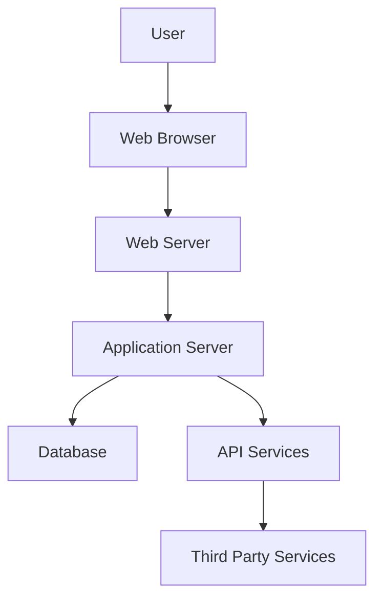

```mermaid
    graph TD;
        A[User] --> B[Web Browser];
        B --> C[Web Server];
        C --> D[Application Server];
        D --> E[Database];
        D --> F[API Services];
        F --> G[Third Party Services];
```